# RASPUTIN Architecture Diagrams

This document contains Mermaid diagrams illustrating the architecture and components of the RASPUTIN multi-model AI consensus and synthesis engine with autonomous agent capabilities (JARVIS).

---

## 1. High-Level System Architecture

```mermaid
graph TB
    subgraph "Client Layer"
        UI[React 19 Frontend]
        WS[WebSocket Client]
    end

    subgraph "API Gateway"
        TRPC[tRPC Server]
        EXPRESS[Express 4]
        AUTH[Manus OAuth]
    end

    subgraph "Core Services"
        CONSENSUS[Consensus Engine]
        SYNTHESIS[Synthesis Pipeline]
        JARVIS[JARVIS Agent]
        MULTIAGENT[Multi-Agent Orchestrator]
    end

    subgraph "AI Providers"
        OPENAI[OpenAI GPT-5.x]
        ANTHROPIC[Anthropic Claude 4.5]
        GOOGLE[Google Gemini 3]
        XAI[xAI Grok 4]
        PERPLEXITY[Perplexity Sonar]
        CEREBRAS[Cerebras Llama]
    end

    subgraph "Infrastructure Layer"
        SSH_MGR[SSH Manager]
        INFRA[Infrastructure Monitor]
        HEALTH[Health Collector]
        ALERTS[Alert Engine]
    end

    subgraph "Data Layer"
        DB[(MySQL/TiDB)]
        DRIZZLE[Drizzle ORM]
        MEMORY[Memory Service]
        RAG[RAG Indexer]
    end

    subgraph "External Services"
        SEARXNG[SearXNG Search]
        ELEVENLABS[ElevenLabs TTS]
        WEBHOOKS[Webhook Endpoints]
    end

    UI --> TRPC
    WS --> EXPRESS
    TRPC --> EXPRESS
    EXPRESS --> AUTH

    TRPC --> CONSENSUS
    TRPC --> SYNTHESIS
    TRPC --> JARVIS
    TRPC --> MULTIAGENT
    TRPC --> INFRA

    CONSENSUS --> OPENAI
    CONSENSUS --> ANTHROPIC
    CONSENSUS --> GOOGLE
    CONSENSUS --> XAI
    CONSENSUS --> PERPLEXITY
    CONSENSUS --> CEREBRAS

    SYNTHESIS --> ANTHROPIC
    SYNTHESIS --> PERPLEXITY

    JARVIS --> ANTHROPIC
    JARVIS --> CEREBRAS
    JARVIS --> GOOGLE
    JARVIS --> XAI
    JARVIS --> SSH_MGR

    INFRA --> SSH_MGR
    INFRA --> HEALTH
    HEALTH --> ALERTS

    CONSENSUS --> DRIZZLE
    SYNTHESIS --> DRIZZLE
    JARVIS --> DRIZZLE
    DRIZZLE --> DB

    JARVIS --> MEMORY
    JARVIS --> RAG

    JARVIS --> SEARXNG
    JARVIS --> ELEVENLABS

    SSH_MGR --> WEBHOOKS
```

---

## 2. Frontend Component Architecture

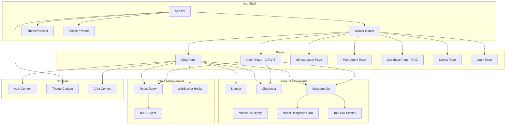

---

## 3. Backend tRPC API Architecture

```mermaid
graph TB
    subgraph "Router Structure"
        APP_ROUTER[appRouter]
    end

    subgraph "Auth Router"
        AUTH_ME[auth.me]
        AUTH_LOGOUT[auth.logout]
    end

    subgraph "Chats Router"
        CHATS_LIST[chats.list]
        CHATS_GET[chats.get]
        CHATS_CREATE[chats.create]
        CHATS_UPDATE[chats.update]
        CHATS_DELETE[chats.delete]
        CHATS_SEARCH[chats.search]
        CHATS_EXPORT[chats.exportMarkdown]
    end

    subgraph "Query Router"
        QUERY_SUBMIT[query.submit]
        QUERY_MODELS[query.getModelResponses]
        QUERY_STAGES[query.getPipelineStages]
    end

    subgraph "JARVIS Router"
        JARVIS_LIST[jarvis.listTasks]
        JARVIS_GET[jarvis.getTask]
        JARVIS_EXEC[jarvis.executeTask]
        JARVIS_MSGS[jarvis.getTaskMessages]
        JARVIS_USAGE[jarvis.getUsageStats]
    end

    subgraph "SSH Router"
        SSH_HOSTS[ssh.listHosts]
        SSH_CREATE[ssh.createHost]
        SSH_TEST[ssh.testConnection]
        SSH_EXEC[ssh.executeCommand]
        SSH_READ[ssh.readFile]
        SSH_WRITE[ssh.writeFile]
        SSH_PERMS[ssh.getPermissions]
        SSH_AUDIT[ssh.getAuditLog]
    end

    subgraph "Infrastructure Router"
        INFRA_HOSTS[infrastructure.listHosts]
        INFRA_ADD[infrastructure.addHost]
        INFRA_METRICS[infrastructure.getMetrics]
        INFRA_INCIDENTS[infrastructure.getIncidents]
        INFRA_ALERTS[infrastructure.getAlertRules]
    end

    subgraph "Multi-Agent Router"
        AGENTS_LIST[agents.list]
        AGENTS_CREATE[agents.create]
        AGENTS_RUN[agents.runTask]
        AGENTS_MSGS[agents.getMessages]
    end

    subgraph "Other Routers"
        MODELS[models.list / getForTier]
        WORKSPACE[workspace.*]
        SCHEDULE[schedule.*]
        VOICE[voice.*]
        RAG_ROUTER[rag.*]
        EVENTS_ROUTER[events.*]
    end

    APP_ROUTER --> AUTH_ME
    APP_ROUTER --> AUTH_LOGOUT
    APP_ROUTER --> CHATS_LIST
    APP_ROUTER --> CHATS_GET
    APP_ROUTER --> CHATS_CREATE
    APP_ROUTER --> QUERY_SUBMIT
    APP_ROUTER --> JARVIS_LIST
    APP_ROUTER --> JARVIS_EXEC
    APP_ROUTER --> SSH_HOSTS
    APP_ROUTER --> SSH_EXEC
    APP_ROUTER --> INFRA_HOSTS
    APP_ROUTER --> INFRA_METRICS
    APP_ROUTER --> AGENTS_LIST
    APP_ROUTER --> AGENTS_RUN
    APP_ROUTER --> MODELS
    APP_ROUTER --> WORKSPACE
    APP_ROUTER --> RAG_ROUTER
```

---

## 4. Database Schema Relationships

```mermaid
erDiagram
    users ||--o{ chats : "owns"
    users ||--o{ agentTasks : "owns"
    users ||--o{ sshHosts : "owns"
    users ||--o{ infrastructureHosts : "owns"
    users ||--o{ workspaces : "owns"
    users ||--o{ scheduledTasks : "owns"

    chats ||--o{ messages : "contains"
    messages ||--o{ modelResponses : "has"
    messages ||--o{ synthesisPipelineStages : "has"

    agentTasks ||--o{ agentMessages : "contains"
    agentTasks ||--o{ agentToolCalls : "has"
    agentTasks ||--o{ agentFiles : "creates"

    sshHosts ||--o| sshCredentials : "has"
    sshHosts ||--o| sshPermissions : "has"
    sshHosts ||--o{ sshAuditLog : "logs"
    sshHosts ||--o{ pendingApprovals : "has"

    infrastructureHosts ||--o{ healthMetrics : "collects"
    infrastructureHosts ||--o{ incidents : "triggers"
    infrastructureHosts }o--o| sshHosts : "links"

    incidents ||--o{ incidentActions : "has"
    alertRules ||--o{ incidents : "triggers"
    remediations ||--o{ incidentActions : "executes"

    workspaces ||--o{ workspaceFiles : "contains"
    workspaces ||--o{ workspaceCommits : "tracks"
    workspaces ||--o{ workspaceProcesses : "runs"

    agents ||--o{ interAgentMessages : "sends"
    agents ||--o{ agentSubtasks : "creates"

    codebaseProjects ||--o{ codeChunks : "indexes"
    codebaseProjects ||--o{ codeSymbols : "extracts"

    episodicMemories ||--o| memoryEmbeddings : "has"
    semanticMemories ||--o| memoryEmbeddings : "has"
    proceduralMemories ||--o| memoryEmbeddings : "has"

    scheduledTasks ||--o{ scheduledTaskRuns : "executes"

    users {
        int id PK
        varchar openId UK
        text name
        varchar email
        enum role
        timestamp createdAt
    }

    chats {
        int id PK
        int userId FK
        varchar title
        enum mode
        enum speedTier
        json selectedModels
        int messageCount
    }

    messages {
        int id PK
        int chatId FK
        enum role
        text content
        int agreementPercentage
        int latencyMs
    }

    agentTasks {
        int id PK
        int userId FK
        varchar title
        text query
        enum status
        text result
        int iterationCount
    }

    sshHosts {
        int id PK
        int userId FK
        varchar name
        varchar hostname
        int port
        varchar username
        enum authType
        enum status
    }

    infrastructureHosts {
        int id PK
        int userId FK
        varchar name
        varchar hostname
        enum hostType
        enum status
        int sshHostId FK
    }

    healthMetrics {
        int id PK
        int hostId FK
        decimal cpuUsagePercent
        int memoryUsedMb
        decimal diskUsagePercent
        timestamp collectedAt
    }
```

---

## 5. JARVIS Agent Orchestration Flow

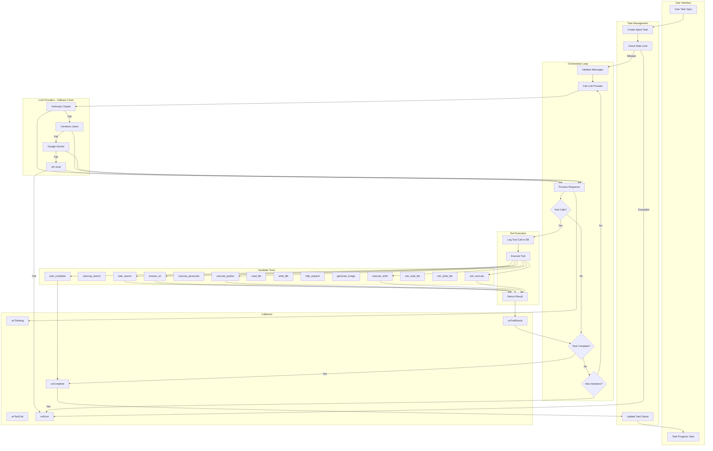

---

## 6. Infrastructure Monitoring System

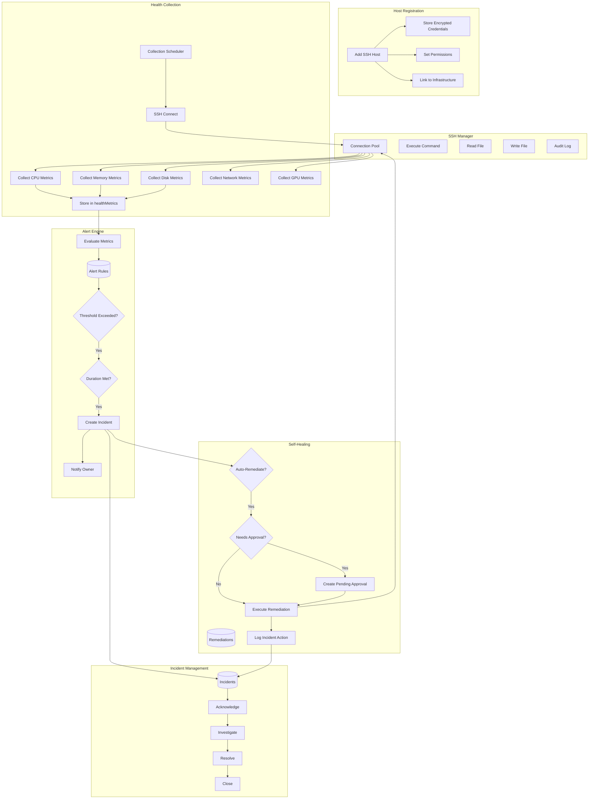

---

## 7. Consensus & Synthesis Data Flow

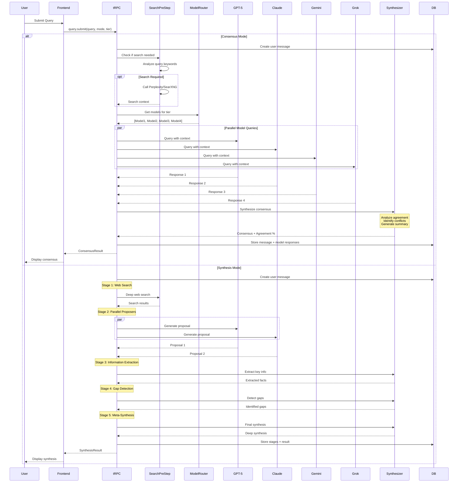

---

## 8. Multi-Agent System Architecture

```mermaid
flowchart TB
    subgraph "Agent Types"
        ORCHESTRATOR[Orchestrator Agent]
        COORDINATOR[Coordinator Agent]
        CODE_AGENT[Code Specialist]
        RESEARCH_AGENT[Research Specialist]
        SYSADMIN_AGENT[SysAdmin Specialist]
        DATA_AGENT[Data Specialist]
        WORKER[Worker Agent]
    end

    subgraph "Agent Lifecycle"
        CREATE[Create Agent]
        ASSIGN_GOAL[Assign Goal]
        THINKING[Thinking State]
        EXECUTING[Executing State]
        WAITING[Waiting State]
        COMPLETED[Completed State]
        FAILED[Failed State]
    end

    subgraph "Task Delegation"
        PARENT_TASK[Parent Task]
        DECOMPOSE[Decompose Task]
        SUBTASK_1[Subtask 1]
        SUBTASK_2[Subtask 2]
        SUBTASK_3[Subtask 3]
        AGGREGATE[Aggregate Results]
    end

    subgraph "Inter-Agent Communication"
        MSG_QUEUE[Message Queue]
        TASK_MSG[Task Message]
        RESULT_MSG[Result Message]
        QUERY_MSG[Query Message]
        STATUS_MSG[Status Message]
    end

    subgraph "Agent Capabilities"
        CAN_BROWSE[canBrowse]
        CAN_CODE[canCode]
        CAN_SSH[canSSH]
        CAN_SEARCH[canSearch]
        CAN_IMAGE[canGenerateImages]
    end

    ORCHESTRATOR --> COORDINATOR
    COORDINATOR --> CODE_AGENT
    COORDINATOR --> RESEARCH_AGENT
    COORDINATOR --> SYSADMIN_AGENT
    COORDINATOR --> DATA_AGENT

    CREATE --> ASSIGN_GOAL
    ASSIGN_GOAL --> THINKING
    THINKING --> EXECUTING
    EXECUTING --> WAITING
    WAITING --> THINKING
    EXECUTING --> COMPLETED
    EXECUTING --> FAILED

    PARENT_TASK --> DECOMPOSE
    DECOMPOSE --> SUBTASK_1
    DECOMPOSE --> SUBTASK_2
    DECOMPOSE --> SUBTASK_3
    SUBTASK_1 --> AGGREGATE
    SUBTASK_2 --> AGGREGATE
    SUBTASK_3 --> AGGREGATE

    ORCHESTRATOR -->|sends| MSG_QUEUE
    MSG_QUEUE -->|delivers| COORDINATOR
    COORDINATOR -->|sends| MSG_QUEUE
    MSG_QUEUE -->|delivers| CODE_AGENT
    CODE_AGENT -->|sends| MSG_QUEUE
    MSG_QUEUE -->|delivers| COORDINATOR

    CODE_AGENT --> CAN_CODE
    CODE_AGENT --> CAN_BROWSE
    RESEARCH_AGENT --> CAN_SEARCH
    RESEARCH_AGENT --> CAN_BROWSE
    SYSADMIN_AGENT --> CAN_SSH
    SYSADMIN_AGENT --> CAN_CODE
```

---

## 9. Memory & Learning System

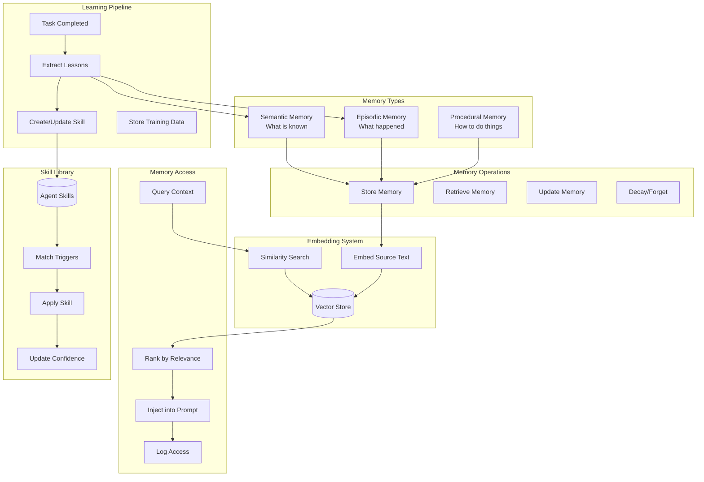

---

## 10. Event & Webhook System

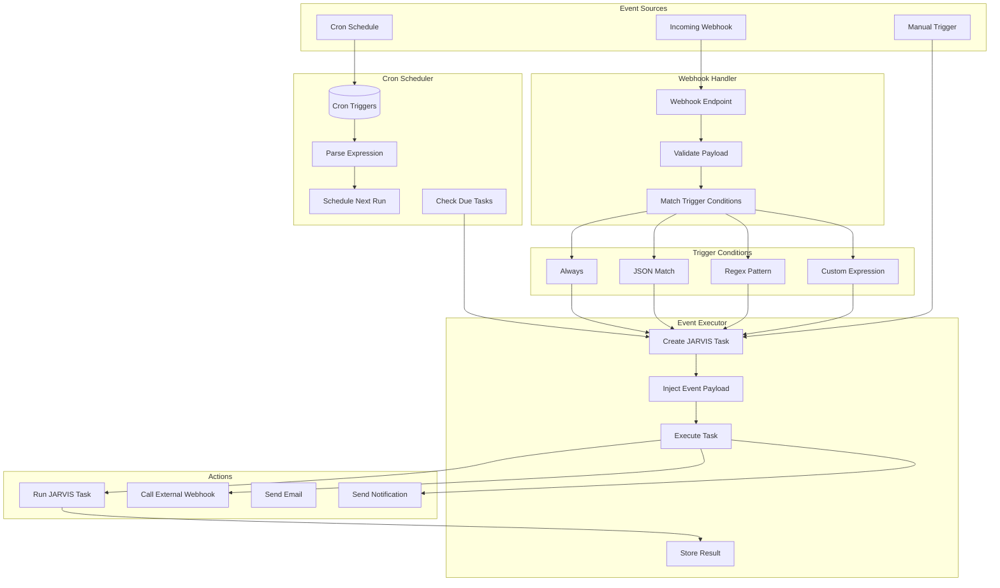

---

## 11. RAG Pipeline for Codebase Understanding

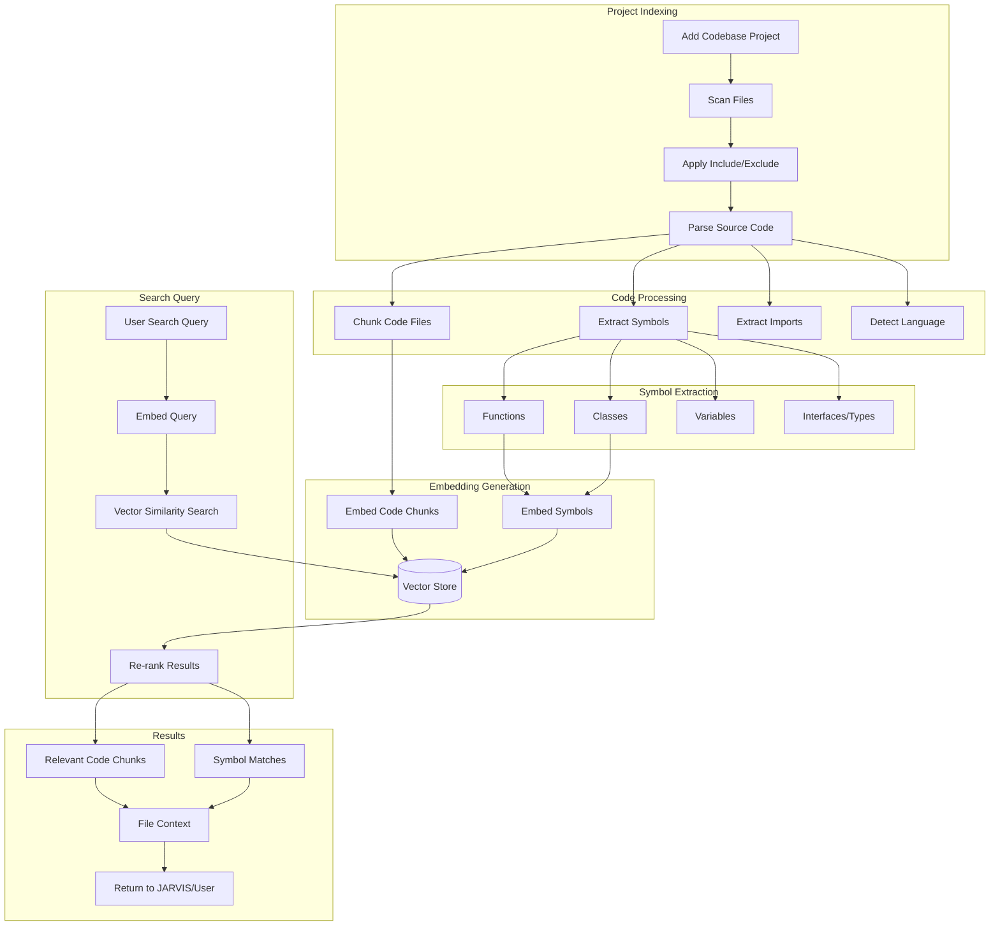

---

## Summary

RASPUTIN is a comprehensive AI orchestration platform with the following key components:

| Component                  | Description                                                            |
| -------------------------- | ---------------------------------------------------------------------- |
| **Consensus Engine**       | Queries multiple frontier AI models in parallel, synthesizes agreement |
| **Synthesis Pipeline**     | 5-stage deep research with web search, proposals, gap detection        |
| **JARVIS Agent**           | Autonomous task executor with 15+ tools and multi-provider fallback    |
| **Multi-Agent System**     | Hierarchical agent coordination with specialized roles                 |
| **Infrastructure Monitor** | SSH-based health collection with alerting and auto-remediation         |
| **Memory System**          | Episodic, semantic, and procedural memory with embeddings              |
| **RAG Pipeline**           | Codebase indexing and semantic search for code understanding           |
| **Event System**           | Webhooks and cron triggers for automated task execution                |

The system is built on:

- **Frontend**: React 19 + Tailwind 4 + Vite
- **Backend**: Express 4 + tRPC 11 + TypeScript
- **Database**: MySQL/TiDB with Drizzle ORM
- **Auth**: Manus OAuth
