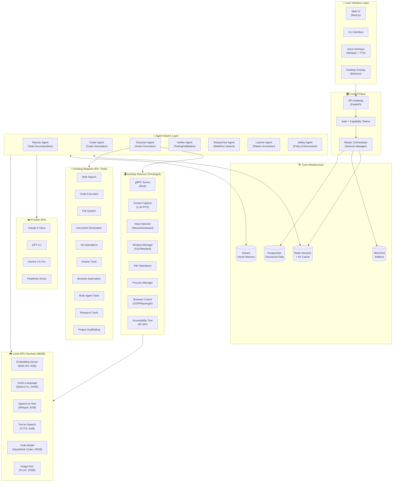
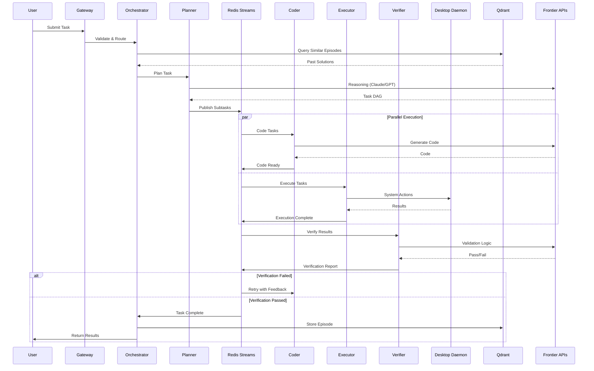

# 2. Architecture Overview

## 2.1 System Architecture Diagram

## 2.2 Data Flow Diagram

## 2.3 Component Interaction Matrix

| Component    | Redis | Qdrant | Daemon | Frontier | Local GPU  | Rasputin     |
| ------------ | ----- | ------ | ------ | -------- | ---------- | ------------ |
| Orchestrator | R/W   | R      | -      | -        | -          | -            |
| Planner      | R/W   | R      | -      | R        | -          | -            |
| Coder        | R/W   | R/W    | -      | R        | R (CodeLM) | R (scaffold) |
| Executor     | R/W   | R      | R/W    | -        | R (Vision) | R/W (all)    |
| Verifier     | R/W   | R      | R      | R        | -          | R (tests)    |
| Researcher   | R/W   | R/W    | R      | R        | -          | R (search)   |
| Learner      | R     | R/W    | -      | R        | R (Embed)  | -            |
| Safety       | R/W   | R      | -      | R        | -          | -            |

---
