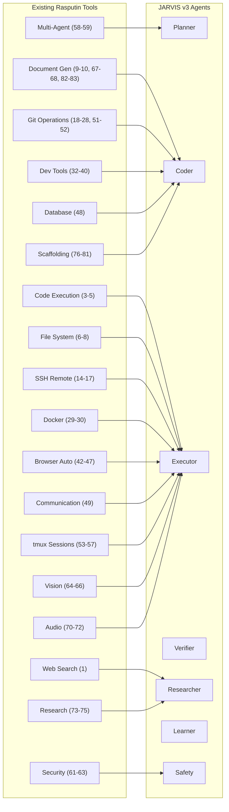

# 3. Existing Rasputin Integration Map

## 3.1 Tool Category Mapping

The existing 83+ Rasputin tools map to JARVIS v3 agents as follows:



## 3.2 Extension Points

### 3.2.1 New Tool Wrappers

Each existing tool gets wrapped with JARVIS v3 metadata:

```typescript
// jarvis/tools/wrapper.ts
import { Tool, ToolResult } from "@rasputin/core";

interface JARVISToolMetadata {
  agentAffinity: (
    | "planner"
    | "coder"
    | "executor"
    | "verifier"
    | "researcher"
    | "learner"
    | "safety"
  )[];
  requiresLease: string[]; // Resources that need locking
  riskLevel: "low" | "medium" | "high" | "critical";
  estimatedDuration: number; // milliseconds
  canParallelize: boolean;
  qdrantCollections: string[]; // Collections to query/update
}

interface JARVISToolWrapper<T extends Tool> {
  tool: T;
  metadata: JARVISToolMetadata;

  // Pre-execution hooks
  beforeExecute(context: ExecutionContext): Promise<void>;

  // Post-execution hooks
  afterExecute(result: ToolResult, context: ExecutionContext): Promise<void>;

  // Learning hook
  extractLearning(result: ToolResult): Promise<LearningPayload | null>;
}

// Example: Wrapping scaffold_project
const scaffoldProjectWrapper: JARVISToolWrapper<typeof scaffold_project> = {
  tool: scaffold_project,
  metadata: {
    agentAffinity: ["coder"],
    requiresLease: ["filesystem:/workspaces"],
    riskLevel: "medium",
    estimatedDuration: 30000,
    canParallelize: false,
    qdrantCollections: ["skills", "code_snippets"],
  },

  async beforeExecute(context) {
    // Query Qdrant for similar past scaffolds
    const similar = await context.qdrant.search("skills", {
      vector: await embed(context.task.description),
      filter: { domain: "scaffolding" },
      limit: 3,
    });
    context.enrichment = { similarProjects: similar };
  },

  async afterExecute(result, context) {
    // Store successful scaffold as skill
    if (result.success) {
      await context.qdrant.upsert("skills", {
        id: uuid(),
        vector: await embed(JSON.stringify(result)),
        payload: {
          type: "scaffold",
          params: context.params,
          timestamp: Date.now(),
        },
      });
    }
  },

  async extractLearning(result) {
    if (!result.success) return null;
    return {
      type: "scaffold_pattern",
      pattern: result.generatedStructure,
      successMetrics: result.metrics,
    };
  },
};
```

### 3.2.2 Tool Registry Extension

```typescript
// jarvis/tools/registry.ts
import { existingTools } from "@rasputin/tools";
import { JARVISToolWrapper } from "./wrapper";

class JARVISToolRegistry {
  private tools: Map<string, JARVISToolWrapper<any>> = new Map();
  private byAgent: Map<string, Set<string>> = new Map();

  constructor() {
    // Initialize agent affinity maps
    const agents = [
      "planner",
      "coder",
      "executor",
      "verifier",
      "researcher",
      "learner",
      "safety",
    ];
    agents.forEach(a => this.byAgent.set(a, new Set()));
  }

  register(name: string, wrapper: JARVISToolWrapper<any>) {
    this.tools.set(name, wrapper);
    wrapper.metadata.agentAffinity.forEach(agent => {
      this.byAgent.get(agent)!.add(name);
    });
  }

  getToolsForAgent(agent: string): JARVISToolWrapper<any>[] {
    const toolNames = this.byAgent.get(agent) || new Set();
    return Array.from(toolNames).map(name => this.tools.get(name)!);
  }

  async executeWithHooks(
    name: string,
    params: any,
    context: ExecutionContext
  ): Promise<ToolResult> {
    const wrapper = this.tools.get(name);
    if (!wrapper) throw new Error(`Tool ${name} not found`);

    // Acquire leases
    for (const lease of wrapper.metadata.requiresLease) {
      await context.leaseManager.acquire(lease, context.sessionId);
    }

    try {
      await wrapper.beforeExecute(context);
      const result = await wrapper.tool.execute(params);
      await wrapper.afterExecute(result, context);

      // Extract learning asynchronously
      const learning = await wrapper.extractLearning(result);
      if (learning) {
        context.redis.xadd("jarvis.learning.v1", "*", learning);
      }

      return result;
    } finally {
      // Release leases
      for (const lease of wrapper.metadata.requiresLease) {
        await context.leaseManager.release(lease, context.sessionId);
      }
    }
  }
}

// Initialize with all existing Rasputin tools
export const toolRegistry = new JARVISToolRegistry();

// Register all 83+ existing tools with JARVIS metadata
Object.entries(existingTools).forEach(([name, tool]) => {
  toolRegistry.register(name, createDefaultWrapper(name, tool));
});
```

## 3.3 Backward Compatibility Layer

```typescript
// jarvis/compat/rasputin.ts

/**
 * Ensures all existing Rasputin functionality continues to work
 * while adding JARVIS v3 capabilities
 */
export class RasputinCompatLayer {
  private registry: JARVISToolRegistry;

  constructor(registry: JARVISToolRegistry) {
    this.registry = registry;
  }

  /**
   * Execute a tool exactly as Rasputin would
   * (no JARVIS hooks, no learning, no leases)
   */
  async executeLegacy(toolName: string, params: any): Promise<any> {
    const wrapper = this.registry.tools.get(toolName);
    if (!wrapper) throw new Error(`Tool ${toolName} not found`);
    return wrapper.tool.execute(params);
  }

  /**
   * Execute with full JARVIS v3 capabilities
   */
  async executeEnhanced(
    toolName: string,
    params: any,
    context: ExecutionContext
  ): Promise<ToolResult> {
    return this.registry.executeWithHooks(toolName, params, context);
  }

  /**
   * Get tool metadata for planning
   */
  getToolMetadata(toolName: string): JARVISToolMetadata | null {
    return this.registry.tools.get(toolName)?.metadata || null;
  }

  /**
   * List all available tools with their capabilities
   */
  listTools(): ToolCatalog {
    return Array.from(this.registry.tools.entries()).map(([name, wrapper]) => ({
      name,
      description: wrapper.tool.description,
      parameters: wrapper.tool.parameters,
      metadata: wrapper.metadata,
    }));
  }
}
```

---
