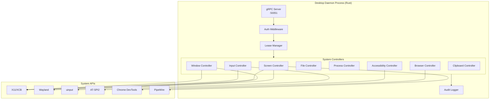

# 4. Desktop Daemon Specification

## 4.1 Overview

The Desktop Daemon is the "MANUS-killer" - a privileged local service that provides complete OS control. It runs as a system service with elevated permissions and exposes a gRPC API for agents to control the desktop.

### 4.1.1 Design Principles

1. **Rust for Safety** - Memory-safe, zero-cost abstractions
2. **gRPC for Speed** - Low-latency, streaming support
3. **Capability-Based Security** - Fine-grained permission tokens
4. **Lease-Based Coordination** - Prevent multi-agent conflicts
5. **Full Audit Trail** - Every action logged

### 4.1.2 Architecture



## 4.2 gRPC Protocol Definition

```protobuf
// jarvis/daemon/proto/daemon.proto
syntax = "proto3";

package jarvis.daemon.v1;

option go_package = "github.com/jarvis/daemon/gen/v1;daemonv1";

// ============================================================================
// COMMON TYPES
// ============================================================================

message Capability {
  string token = 1;           // JWT/PASETO signed by Control Plane
  repeated string scopes = 2; // Granted permissions
  int64 expires_at = 3;       // Unix timestamp
  string session_id = 4;      // Session identifier
  string user_id = 5;         // User identifier
}

message Empty {}

message Status {
  bool success = 1;
  string message = 2;
  string error_code = 3;
}

message Rect {
  int32 x = 1;
  int32 y = 2;
  int32 width = 3;
  int32 height = 4;
}

message Point {
  int32 x = 1;
  int32 y = 2;
}

// ============================================================================
// SCREEN CAPTURE
// ============================================================================

message Display {
  int32 id = 1;
  string name = 2;
  int32 width = 3;
  int32 height = 4;
  float scale = 5;
  bool primary = 6;
}

message ListDisplaysRequest {
  Capability cap = 1;
}

message ListDisplaysResponse {
  repeated Display displays = 1;
}

message ScreenshotRequest {
  Capability cap = 1;
  int32 display_id = 2;       // 0 = primary
  Rect region = 3;            // Optional, null = full screen
  string format = 4;          // "png", "jpeg", "webp"
  int32 quality = 5;          // 1-100 for jpeg/webp
  bool include_cursor = 6;
}

message Screenshot {
  bytes image_data = 1;
  int64 timestamp_ms = 2;
  Display display = 3;
  Rect captured_region = 4;
}

message ScreenStreamRequest {
  Capability cap = 1;
  int32 display_id = 2;
  int32 fps = 3;              // 1-30
  Rect region = 4;
  string format = 5;          // "jpeg" recommended
  int32 quality = 6;
  bool include_cursor = 7;
  bool delta_encoding = 8;    // Send only changed regions
}

message ScreenFrame {
  bytes data = 1;
  int64 timestamp_ms = 2;
  bool is_keyframe = 3;
  Rect dirty_region = 4;      // Changed region if delta_encoding
}

// ============================================================================
// INPUT INJECTION
// ============================================================================

message MouseMoveRequest {
  Capability cap = 1;
  int32 x = 2;
  int32 y = 3;
  int32 display_id = 4;
  bool relative = 5;          // true = relative movement
  int32 duration_ms = 6;      // 0 = instant, >0 = smooth movement
}

message MouseButtonRequest {
  Capability cap = 1;
  enum Button {
    LEFT = 0;
    RIGHT = 1;
    MIDDLE = 2;
    BACK = 3;
    FORWARD = 4;
  }
  Button button = 2;
  enum Action {
    PRESS = 0;
    RELEASE = 1;
    CLICK = 2;       // Press + Release
    DOUBLE_CLICK = 3;
  }
  Action action = 3;
  Point position = 4;         // Optional, null = current position
  int32 display_id = 5;
}

message MouseScrollRequest {
  Capability cap = 1;
  int32 delta_x = 2;          // Horizontal scroll
  int32 delta_y = 3;          // Vertical scroll
  Point position = 4;         // Optional
  int32 display_id = 5;
}

message KeyboardKeyRequest {
  Capability cap = 1;
  string key = 2;             // Key name: "a", "Enter", "F1", "Ctrl", etc.
  enum Action {
    PRESS = 0;
    RELEASE = 1;
    TAP = 2;         // Press + Release
  }
  Action action = 3;
  repeated string modifiers = 4; // "Ctrl", "Shift", "Alt", "Meta"
}

message KeyboardTypeRequest {
  Capability cap = 1;
  string text = 2;
  int32 delay_ms = 3;         // Delay between characters
}

message KeyboardShortcutRequest {
  Capability cap = 1;
  repeated string keys = 2;   // e.g., ["Ctrl", "Shift", "P"]
}

// ============================================================================
// WINDOW MANAGEMENT
// ============================================================================

message Window {
  string id = 1;              // Window handle/ID
  string title = 2;
  string app_name = 3;
  string process_name = 4;
  int32 pid = 5;
  Rect bounds = 6;
  bool focused = 7;
  bool minimized = 8;
  bool maximized = 9;
  int32 display_id = 10;
}

message ListWindowsRequest {
  Capability cap = 1;
  bool include_minimized = 2;
  bool include_hidden = 3;
  string filter_app = 4;      // Optional app name filter
}

message ListWindowsResponse {
  repeated Window windows = 1;
}

message FocusWindowRequest {
  Capability cap = 1;
  string window_id = 2;
}

message MoveWindowRequest {
  Capability cap = 1;
  string window_id = 2;
  Rect bounds = 3;
}

message WindowActionRequest {
  Capability cap = 1;
  string window_id = 2;
  enum Action {
    MINIMIZE = 0;
    MAXIMIZE = 1;
    RESTORE = 2;
    CLOSE = 3;
  }
  Action action = 3;
}

// ============================================================================
// ACCESSIBILITY TREE
// ============================================================================

message AccessibilityNode {
  string id = 1;
  string role = 2;            // "button", "textfield", "menu", etc.
  string name = 3;
  string description = 4;
  string value = 5;
  Rect bounds = 6;
  repeated string states = 7; // "focused", "enabled", "checked", etc.
  repeated string actions = 8; // Available actions
  repeated AccessibilityNode children = 9;
}

message GetAccessibilityTreeRequest {
  Capability cap = 1;
  string window_id = 2;       // Optional, null = focused window
  int32 max_depth = 3;        // 0 = unlimited
}

message GetAccessibilityTreeResponse {
  AccessibilityNode root = 1;
  string window_id = 2;
}

message FindAccessibilityNodeRequest {
  Capability cap = 1;
  string window_id = 2;
  string role = 3;            // Optional filter
  string name_contains = 4;   // Optional filter
  int32 limit = 5;
}

message FindAccessibilityNodeResponse {
  repeated AccessibilityNode nodes = 1;
}

message PerformAccessibilityActionRequest {
  Capability cap = 1;
  string node_id = 2;
  string action = 3;          // "click", "focus", "setValue", etc.
  string value = 4;           // For setValue
}

// ============================================================================
// FILE SYSTEM
// ============================================================================

message FileInfo {
  string path = 1;
  string name = 2;
  bool is_dir = 3;
  int64 size = 4;
  int64 modified_ms = 5;
  int64 created_ms = 6;
  string permissions = 7;     // e.g., "rwxr-xr-x"
}

message ListFilesRequest {
  Capability cap = 1;
  string path = 2;
  bool recursive = 3;
  int32 max_depth = 4;
  string pattern = 5;         // Glob pattern
}

message ListFilesResponse {
  repeated FileInfo files = 1;
}

message ReadFileRequest {
  Capability cap = 1;
  string path = 2;
  int64 offset = 3;
  int64 max_bytes = 4;        // 0 = all
}

message ReadFileResponse {
  bytes data = 1;
  bool truncated = 2;
  int64 total_size = 3;
}

message WriteFileRequest {
  Capability cap = 1;
  string path = 2;
  bytes data = 3;
  bool create_dirs = 4;
  bool atomic = 5;            // Write to temp, then rename
  string mode = 6;            // e.g., "0644"
  bool append = 7;
}

message DeleteFileRequest {
  Capability cap = 1;
  string path = 2;
  bool recursive = 3;
}

message CopyFileRequest {
  Capability cap = 1;
  string source = 2;
  string destination = 3;
  bool overwrite = 4;
}

message MoveFileRequest {
  Capability cap = 1;
  string source = 2;
  string destination = 3;
  bool overwrite = 4;
}

// ============================================================================
// PROCESS MANAGEMENT
// ============================================================================

message ProcessInfo {
  int32 pid = 1;
  int32 ppid = 2;
  string name = 3;
  string cmdline = 4;
  string user = 5;
  float cpu_percent = 6;
  int64 memory_bytes = 7;
  int64 started_ms = 8;
  string status = 9;          // "running", "sleeping", "zombie", etc.
}

message ListProcessesRequest {
  Capability cap = 1;
  string filter_name = 2;
  string filter_user = 3;
}

message ListProcessesResponse {
  repeated ProcessInfo processes = 1;
}

message StartProcessRequest {
  Capability cap = 1;
  string command = 2;
  repeated string args = 3;
  string working_dir = 4;
  map<string, string> env = 5;
  bool detached = 6;
}

message StartProcessResponse {
  int32 pid = 1;
}

message KillProcessRequest {
  Capability cap = 1;
  int32 pid = 2;
  string signal = 3;          // "SIGTERM", "SIGKILL", "SIGINT"
}

// ============================================================================
// SHELL EXECUTION
// ============================================================================

message ShellExecRequest {
  Capability cap = 1;
  string command = 2;
  string working_dir = 3;
  map<string, string> env = 4;
  int32 timeout_seconds = 5;
  bool stream_output = 6;
}

message ShellExecResponse {
  int32 exit_code = 1;
  bytes stdout = 2;
  bytes stderr = 3;
  int64 duration_ms = 4;
}

message ShellExecChunk {
  enum Stream {
    STDOUT = 0;
    STDERR = 1;
  }
  Stream stream = 1;
  bytes data = 2;
  int64 timestamp_ms = 3;
}

// ============================================================================
// CLIPBOARD
// ============================================================================

message GetClipboardRequest {
  Capability cap = 1;
}

message GetClipboardResponse {
  string text = 1;
  bytes image = 2;            // PNG if image content
  string mime_type = 3;
}

message SetClipboardRequest {
  Capability cap = 1;
  string text = 2;
  bytes image = 3;
}

// ============================================================================
// BROWSER AUTOMATION (CDP Integration)
// ============================================================================

message BrowserSession {
  string id = 1;
  string profile_id = 2;
  bool headless = 3;
  string user_agent = 4;
}

message BrowserOpenRequest {
  Capability cap = 1;
  string profile_id = 2;      // Isolated profile directory
  bool headless = 3;
  string user_agent = 4;
  repeated string args = 5;   // Additional browser args
}

message BrowserOpenResponse {
  BrowserSession session = 1;
}

message BrowserNavigateRequest {
  Capability cap = 1;
  string session_id = 2;
  string url = 3;
  int32 timeout_ms = 4;
}

message BrowserNavigateResponse {
  string final_url = 1;
  int32 status_code = 2;
}

message BrowserClickRequest {
  Capability cap = 1;
  string session_id = 2;
  string selector = 3;        // CSS or XPath
  int32 timeout_ms = 4;
}

message BrowserTypeRequest {
  Capability cap = 1;
  string session_id = 2;
  string selector = 3;
  string text = 4;
  int32 delay_ms = 5;
}

message BrowserEvalRequest {
  Capability cap = 1;
  string session_id = 2;
  string script = 3;          // JavaScript
}

message BrowserEvalResponse {
  string result_json = 1;
}

message BrowserScreenshotRequest {
  Capability cap = 1;
  string session_id = 2;
  bool full_page = 3;
  string format = 4;
  int32 quality = 5;
}

message BrowserGetContentRequest {
  Capability cap = 1;
  string session_id = 2;
  enum ContentType {
    HTML = 0;
    TEXT = 1;
  }
  ContentType content_type = 3;
}

message BrowserGetContentResponse {
  string content = 1;
}

message BrowserCloseRequest {
  Capability cap = 1;
  string session_id = 2;
}

// ============================================================================
// SERVICE DEFINITION
// ============================================================================

service DesktopDaemon {
  // Display & Screen
  rpc ListDisplays(ListDisplaysRequest) returns (ListDisplaysResponse);
  rpc Screenshot(ScreenshotRequest) returns (Screenshot);
  rpc ScreenStream(ScreenStreamRequest) returns (stream ScreenFrame);
  
  // Input
  rpc MouseMove(MouseMoveRequest) returns (Status);
  rpc MouseButton(MouseButtonRequest) returns (Status);
  rpc MouseScroll(MouseScrollRequest) returns (Status);
  rpc KeyboardKey(KeyboardKeyRequest) returns (Status);
  rpc KeyboardType(KeyboardTypeRequest) returns (Status);
  rpc KeyboardShortcut(KeyboardShortcutRequest) returns (Status);
  
  // Windows
  rpc ListWindows(ListWindowsRequest) returns (ListWindowsResponse);
  rpc FocusWindow(FocusWindowRequest) returns (Status);
  rpc MoveWindow(MoveWindowRequest) returns (Status);
  rpc WindowAction(WindowActionRequest) returns (Status);
  
  // Accessibility
  rpc GetAccessibilityTree(GetAccessibilityTreeRequest) returns (GetAccessibilityTreeResponse);
  rpc FindAccessibilityNode(FindAccessibilityNodeRequest) returns (FindAccessibilityNodeResponse);
  rpc PerformAccessibilityAction(PerformAccessibilityActionRequest) returns (Status);
  
  // File System
  rpc ListFiles(ListFilesRequest) returns (ListFilesResponse);
  rpc ReadFile(ReadFileRequest) returns (ReadFileResponse);
  rpc WriteFile(WriteFileRequest) returns (Status);
  rpc DeleteFile(DeleteFileRequest) returns (Status);
  rpc CopyFile(CopyFileRequest) returns (Status);
  rpc MoveFile(MoveFileRequest) returns (Status);
  
  // Processes
  rpc ListProcesses(ListProcessesRequest) returns (ListProcessesResponse);
  rpc StartProcess(StartProcessRequest) returns (StartProcessResponse);
  rpc KillProcess(KillProcessRequest) returns (Status);
  
  // Shell
  rpc ShellExec(ShellExecRequest) returns (ShellExecResponse);
  rpc ShellExecStream(ShellExecRequest) returns (stream ShellExecChunk);
  
  // Clipboard
  rpc GetClipboard(GetClipboardRequest) returns (GetClipboardResponse);
  rpc SetClipboard(SetClipboardRequest) returns (Status);
  
  // Browser
  rpc BrowserOpen(BrowserOpenRequest) returns (BrowserOpenResponse);
  rpc BrowserNavigate(BrowserNavigateRequest) returns (BrowserNavigateResponse);
  rpc BrowserClick(BrowserClickRequest) returns (Status);
  rpc BrowserType(BrowserTypeRequest) returns (Status);
  rpc BrowserEval(BrowserEvalRequest) returns (BrowserEvalResponse);
  rpc BrowserScreenshot(BrowserScreenshotRequest) returns (Screenshot);
  rpc BrowserGetContent(BrowserGetContentRequest) returns (BrowserGetContentResponse);
  rpc BrowserClose(BrowserCloseRequest) returns (Status);
}
```

## 4.3 Rust Implementation

### 4.3.1 Project Structure

```
jarvis-daemon/
├── Cargo.toml
├── build.rs                    # Proto compilation
├── proto/
│   └── daemon.proto
├── src/
│   ├── main.rs
│   ├── lib.rs
│   ├── config.rs
│   ├── auth/
│   │   ├── mod.rs
│   │   ├── capability.rs       # Capability token validation
│   │   └── middleware.rs       # gRPC auth interceptor
│   ├── lease/
│   │   ├── mod.rs
│   │   └── manager.rs          # Resource lease management
│   ├── audit/
│   │   ├── mod.rs
│   │   └── logger.rs           # Action audit logging
│   ├── controllers/
│   │   ├── mod.rs
│   │   ├── screen.rs           # Screen capture
│   │   ├── input.rs            # Mouse/keyboard injection
│   │   ├── window.rs           # Window management
│   │   ├── accessibility.rs    # AT-SPI integration
│   │   ├── file.rs             # File operations
│   │   ├── process.rs          # Process management
│   │   ├── shell.rs            # Shell execution
│   │   ├── clipboard.rs        # Clipboard access
│   │   └── browser.rs          # CDP browser control
│   ├── platform/
│   │   ├── mod.rs
│   │   ├── linux/
│   │   │   ├── mod.rs
│   │   │   ├── x11.rs
│   │   │   ├── wayland.rs
│   │   │   ├── uinput.rs
│   │   │   └── atspi.rs
│   │   └── windows/            # Future
│   │       └── mod.rs
│   └── service.rs              # gRPC service implementation
└── tests/
    └── integration_tests.rs
```

### 4.3.2 Core Implementation

```rust
// src/main.rs
use std::net::SocketAddr;
use std::sync::Arc;
use tokio::sync::RwLock;
use tonic::transport::Server;
use tracing::{info, Level};
use tracing_subscriber::FmtSubscriber;

mod auth;
mod audit;
mod config;
mod controllers;
mod lease;
mod platform;
mod service;

use config::DaemonConfig;
use service::DesktopDaemonService;

#[tokio::main]
async fn main() -> Result<(), Box<dyn std::error::Error>> {
    // Initialize logging
    let subscriber = FmtSubscriber::builder()
        .with_max_level(Level::INFO)
        .with_file(true)
        .with_line_number(true)
        .finish();
    tracing::subscriber::set_global_default(subscriber)?;

    // Load configuration
    let config = DaemonConfig::load()?;
    info!("Starting JARVIS Desktop Daemon v{}", env!("CARGO_PKG_VERSION"));
    info!("Binding to {}", config.bind_address);

    // Initialize components
    let auth_manager = Arc::new(auth::AuthManager::new(&config.auth)?);
    let lease_manager = Arc::new(RwLock::new(lease::LeaseManager::new()));
    let audit_logger = Arc::new(audit::AuditLogger::new(&config.audit)?);

    // Initialize platform-specific controllers
    let screen_controller = Arc::new(controllers::ScreenController::new(&config)?);
    let input_controller = Arc::new(controllers::InputController::new(&config)?);
    let window_controller = Arc::new(controllers::WindowController::new(&config)?);
    let a11y_controller = Arc::new(controllers::AccessibilityController::new(&config)?);
    let file_controller = Arc::new(controllers::FileController::new(&config)?);
    let process_controller = Arc::new(controllers::ProcessController::new(&config)?);
    let shell_controller = Arc::new(controllers::ShellController::new(&config)?);
    let clipboard_controller = Arc::new(controllers::ClipboardController::new(&config)?);
    let browser_controller = Arc::new(RwLock::new(controllers::BrowserController::new(&config)?));

    // Create service
    let service = DesktopDaemonService {
        auth_manager,
        lease_manager,
        audit_logger,
        screen: screen_controller,
        input: input_controller,
        window: window_controller,
        accessibility: a11y_controller,
        file: file_controller,
        process: process_controller,
        shell: shell_controller,
        clipboard: clipboard_controller,
        browser: browser_controller,
        config: Arc::new(config.clone()),
    };

    // Build server with auth interceptor
    let addr: SocketAddr = config.bind_address.parse()?;
    
    Server::builder()
        .add_service(
            daemon_proto::desktop_daemon_server::DesktopDaemonServer::with_interceptor(
                service,
                auth::middleware::check_auth,
            )
        )
        .serve(addr)
        .await?;

    Ok(())
}
```

```rust
// src/config.rs
use serde::{Deserialize, Serialize};
use std::path::PathBuf;

#[derive(Debug, Clone, Serialize, Deserialize)]
pub struct DaemonConfig {
    pub bind_address: String,
    pub auth: AuthConfig,
    pub audit: AuditConfig,
    pub security: SecurityConfig,
    pub platform: PlatformConfig,
}

#[derive(Debug, Clone, Serialize, Deserialize)]
pub struct AuthConfig {
    pub jwt_secret: String,
    pub allowed_issuers: Vec<String>,
    pub token_expiry_seconds: u64,
}

#[derive(Debug, Clone, Serialize, Deserialize)]
pub struct AuditConfig {
    pub log_path: PathBuf,
    pub max_size_mb: u64,
    pub retention_days: u32,
}

#[derive(Debug, Clone, Serialize, Deserialize)]
pub struct SecurityConfig {
    pub sandbox_mode: SandboxMode,
    pub allowed_paths: Vec<PathBuf>,
    pub blocked_paths: Vec<PathBuf>,
    pub max_file_size_mb: u64,
    pub rate_limit_per_second: u32,
    pub dangerous_commands: Vec<String>,
}

#[derive(Debug, Clone, Serialize, Deserialize)]
pub enum SandboxMode {
    Strict,    // Only workspace directories
    Standard,  // Broader FS, blocks system dirs
    Admin,     // Full access (requires explicit approval)
}

#[derive(Debug, Clone, Serialize, Deserialize)]
pub struct PlatformConfig {
    pub display_server: DisplayServer,
    pub browser_path: PathBuf,
    pub browser_profile_dir: PathBuf,
}

#[derive(Debug, Clone, Serialize, Deserialize)]
pub enum DisplayServer {
    X11,
    Wayland,
    Auto,
}

impl DaemonConfig {
    pub fn load() -> Result<Self, config::ConfigError> {
        let config_path = std::env::var("JARVIS_DAEMON_CONFIG")
            .unwrap_or_else(|_| "/etc/jarvis/daemon.toml".to_string());
        
        let settings = config::Config::builder()
            .add_source(config::File::with_name(&config_path).required(false))
            .add_source(config::Environment::with_prefix("JARVIS_DAEMON"))
            .build()?;
        
        settings.try_deserialize()
    }
}

impl Default for DaemonConfig {
    fn default() -> Self {
        Self {
            bind_address: "127.0.0.1:50051".to_string(),
            auth: AuthConfig {
                jwt_secret: "change-me-in-production".to_string(),
                allowed_issuers: vec!["jarvis-control-plane".to_string()],
                token_expiry_seconds: 3600,
            },
            audit: AuditConfig {
                log_path: PathBuf::from("/var/log/jarvis/daemon-audit.log"),
                max_size_mb: 100,
                retention_days: 30,
            },
            security: SecurityConfig {
                sandbox_mode: SandboxMode::Standard,
                allowed_paths: vec![
                    PathBuf::from("/home"),
                    PathBuf::from("/tmp"),
                    PathBuf::from("/workspaces"),
                ],
                blocked_paths: vec![
                    PathBuf::from("/etc"),
                    PathBuf::from("/root"),
                    PathBuf::from("/sys"),
                    PathBuf::from("/proc"),
                ],
                max_file_size_mb: 100,
                rate_limit_per_second: 100,
                dangerous_commands: vec![
                    "rm -rf /".to_string(),
                    "mkfs".to_string(),
                    "dd if=/dev/zero".to_string(),
                ],
            },
            platform: PlatformConfig {
                display_server: DisplayServer::Auto,
                browser_path: PathBuf::from("/usr/bin/chromium"),
                browser_profile_dir: PathBuf::from("/var/lib/jarvis/browser-profiles"),
            },
        }
    }
}
```

```rust
// src/controllers/screen.rs
use crate::config::DaemonConfig;
use crate::platform::linux::{x11::X11Screen, wayland::WaylandScreen};
use std::sync::Arc;
use tokio::sync::mpsc;
use tracing::{info, warn};

pub struct ScreenController {
    backend: ScreenBackend,
}

enum ScreenBackend {
    X11(X11Screen),
    Wayland(WaylandScreen),
}

impl ScreenController {
    pub fn new(config: &DaemonConfig) -> Result<Self, Box<dyn std::error::Error>> {
        let backend = match &config.platform.display_server {
            crate::config::DisplayServer::X11 => {
                ScreenBackend::X11(X11Screen::new()?)
            }
            crate::config::DisplayServer::Wayland => {
                ScreenBackend::Wayland(WaylandScreen::new()?)
            }
            crate::config::DisplayServer::Auto => {
                // Try Wayland first, fall back to X11
                if let Ok(wayland) = WaylandScreen::new() {
                    info!("Using Wayland display server");
                    ScreenBackend::Wayland(wayland)
                } else if let Ok(x11) = X11Screen::new() {
                    info!("Using X11 display server");
                    ScreenBackend::X11(x11)
                } else {
                    return Err("No display server available".into());
                }
            }
        };
        
        Ok(Self { backend })
    }
    
    pub fn list_displays(&self) -> Result<Vec<Display>, Box<dyn std::error::Error>> {
        match &self.backend {
            ScreenBackend::X11(x11) => x11.list_displays(),
            ScreenBackend::Wayland(wayland) => wayland.list_displays(),
        }
    }
    
    pub fn capture(
        &self,
        display_id: i32,
        region: Option<Rect>,
        format: ImageFormat,
        quality: u8,
        include_cursor: bool,
    ) -> Result<Vec<u8>, Box<dyn std::error::Error>> {
        match &self.backend {
            ScreenBackend::X11(x11) => {
                x11.capture(display_id, region, format, quality, include_cursor)
            }
            ScreenBackend::Wayland(wayland) => {
                wayland.capture(display_id, region, format, quality, include_cursor)
            }
        }
    }
    
    pub fn stream(
        &self,
        display_id: i32,
        fps: u32,
        region: Option<Rect>,
        format: ImageFormat,
        quality: u8,
        include_cursor: bool,
        delta_encoding: bool,
    ) -> mpsc::Receiver<ScreenFrame> {
        let (tx, rx) = mpsc::channel(fps as usize * 2);
        
        let backend = self.backend.clone();
        tokio::spawn(async move {
            let interval = std::time::Duration::from_millis(1000 / fps as u64);
            let mut last_frame: Option<Vec<u8>> = None;
            
            loop {
                let start = std::time::Instant::now();
                
                let frame_data = match &backend {
                    ScreenBackend::X11(x11) => {
                        x11.capture(display_id, region.clone(), format, quality, include_cursor)
                    }
                    ScreenBackend::Wayland(wayland) => {
                        wayland.capture(display_id, region.clone(), format, quality, include_cursor)
                    }
                };
                
                if let Ok(data) = frame_data {
                    let frame = if delta_encoding && last_frame.is_some() {
                        // Compute delta (simplified - real impl would use proper diff)
                        ScreenFrame {
                            data: data.clone(),
                            timestamp_ms: chrono::Utc::now().timestamp_millis(),
                            is_keyframe: false,
                            dirty_region: None, // Would compute actual dirty region
                        }
                    } else {
                        ScreenFrame {
                            data: data.clone(),
                            timestamp_ms: chrono::Utc::now().timestamp_millis(),
                            is_keyframe: true,
                            dirty_region: None,
                        }
                    };
                    
                    last_frame = Some(data);
                    
                    if tx.send(frame).await.is_err() {
                        break; // Receiver dropped
                    }
                }
                
                let elapsed = start.elapsed();
                if elapsed < interval {
                    tokio::time::sleep(interval - elapsed).await;
                }
            }
        });
        
        rx
    }
}

#[derive(Debug, Clone)]
pub struct Display {
    pub id: i32,
    pub name: String,
    pub width: i32,
    pub height: i32,
    pub scale: f32,
    pub primary: bool,
}

#[derive(Debug, Clone)]
pub struct Rect {
    pub x: i32,
    pub y: i32,
    pub width: i32,
    pub height: i32,
}

#[derive(Debug, Clone, Copy)]
pub enum ImageFormat {
    Png,
    Jpeg,
    Webp,
}

#[derive(Debug, Clone)]
pub struct ScreenFrame {
    pub data: Vec<u8>,
    pub timestamp_ms: i64,
    pub is_keyframe: bool,
    pub dirty_region: Option<Rect>,
}
```

```rust
// src/controllers/input.rs
use crate::config::DaemonConfig;
use crate::platform::linux::uinput::UinputDevice;
use std::sync::Arc;
use tokio::sync::Mutex;
use tracing::info;

pub struct InputController {
    device: Arc<Mutex<UinputDevice>>,
}

impl InputController {
    pub fn new(config: &DaemonConfig) -> Result<Self, Box<dyn std::error::Error>> {
        let device = UinputDevice::new()?;
        info!("Input controller initialized with uinput");
        
        Ok(Self {
            device: Arc::new(Mutex::new(device)),
        })
    }
    
    pub async fn mouse_move(
        &self,
        x: i32,
        y: i32,
        relative: bool,
        duration_ms: u32,
    ) -> Result<(), Box<dyn std::error::Error>> {
        let mut device = self.device.lock().await;
        
        if duration_ms == 0 || relative {
            // Instant movement
            if relative {
                device.mouse_move_relative(x, y)?;
            } else {
                device.mouse_move_absolute(x, y)?;
            }
        } else {
            // Smooth movement
            let current = device.get_mouse_position()?;
            let steps = (duration_ms / 16).max(1) as i32; // ~60fps
            let dx = (x - current.0) as f32 / steps as f32;
            let dy = (y - current.1) as f32 / steps as f32;
            
            for i in 1..=steps {
                let target_x = current.0 + (dx * i as f32) as i32;
                let target_y = current.1 + (dy * i as f32) as i32;
                device.mouse_move_absolute(target_x, target_y)?;
                tokio::time::sleep(std::time::Duration::from_millis(16)).await;
            }
        }
        
        Ok(())
    }
    
    pub async fn mouse_button(
        &self,
        button: MouseButton,
        action: ButtonAction,
        position: Option<(i32, i32)>,
    ) -> Result<(), Box<dyn std::error::Error>> {
        let mut device = self.device.lock().await;
        
        // Move to position if specified
        if let Some((x, y)) = position {
            device.mouse_move_absolute(x, y)?;
        }
        
        match action {
            ButtonAction::Press => device.mouse_button_press(button)?,
            ButtonAction::Release => device.mouse_button_release(button)?,
            ButtonAction::Click => {
                device.mouse_button_press(button)?;
                tokio::time::sleep(std::time::Duration::from_millis(50)).await;
                device.mouse_button_release(button)?;
            }
            ButtonAction::DoubleClick => {
                for _ in 0..2 {
                    device.mouse_button_press(button)?;
                    tokio::time::sleep(std::time::Duration::from_millis(50)).await;
                    device.mouse_button_release(button)?;
                    tokio::time::sleep(std::time::Duration::from_millis(100)).await;
                }
            }
        }
        
        Ok(())
    }
    
    pub async fn mouse_scroll(
        &self,
        delta_x: i32,
        delta_y: i32,
    ) -> Result<(), Box<dyn std::error::Error>> {
        let mut device = self.device.lock().await;
        device.mouse_scroll(delta_x, delta_y)?;
        Ok(())
    }
    
    pub async fn keyboard_key(
        &self,
        key: &str,
        action: KeyAction,
        modifiers: &[String],
    ) -> Result<(), Box<dyn std::error::Error>> {
        let mut device = self.device.lock().await;
        
        // Press modifiers
        for modifier in modifiers {
            device.key_press(modifier)?;
        }
        
        match action {
            KeyAction::Press => device.key_press(key)?,
            KeyAction::Release => device.key_release(key)?,
            KeyAction::Tap => {
                device.key_press(key)?;
                tokio::time::sleep(std::time::Duration::from_millis(30)).await;
                device.key_release(key)?;
            }
        }
        
        // Release modifiers in reverse order
        for modifier in modifiers.iter().rev() {
            device.key_release(modifier)?;
        }
        
        Ok(())
    }
    
    pub async fn keyboard_type(
        &self,
        text: &str,
        delay_ms: u32,
    ) -> Result<(), Box<dyn std::error::Error>> {
        let mut device = self.device.lock().await;
        
        for ch in text.chars() {
            device.type_char(ch)?;
            if delay_ms > 0 {
                tokio::time::sleep(std::time::Duration::from_millis(delay_ms as u64)).await;
            }
        }
        
        Ok(())
    }
    
    pub async fn keyboard_shortcut(
        &self,
        keys: &[String],
    ) -> Result<(), Box<dyn std::error::Error>> {
        let mut device = self.device.lock().await;
        
        // Press all keys
        for key in keys {
            device.key_press(key)?;
            tokio::time::sleep(std::time::Duration::from_millis(30)).await;
        }
        
        // Release all keys in reverse order
        for key in keys.iter().rev() {
            device.key_release(key)?;
            tokio::time::sleep(std::time::Duration::from_millis(30)).await;
        }
        
        Ok(())
    }
}

#[derive(Debug, Clone, Copy)]
pub enum MouseButton {
    Left,
    Right,
    Middle,
    Back,
    Forward,
}

#[derive(Debug, Clone, Copy)]
pub enum ButtonAction {
    Press,
    Release,
    Click,
    DoubleClick,
}

#[derive(Debug, Clone, Copy)]
pub enum KeyAction {
    Press,
    Release,
    Tap,
}
```

```rust
// src/controllers/accessibility.rs
use crate::config::DaemonConfig;
use atspi::{Connection, AccessibleExt};
use std::sync::Arc;
use tokio::sync::Mutex;
use tracing::info;

pub struct AccessibilityController {
    connection: Arc<Mutex<Connection>>,
}

impl AccessibilityController {
    pub fn new(config: &DaemonConfig) -> Result<Self, Box<dyn std::error::Error>> {
        let connection = Connection::new()?;
        info!("Accessibility controller initialized with AT-SPI");
        
        Ok(Self {
            connection: Arc::new(Mutex::new(connection)),
        })
    }
    
    pub async fn get_tree(
        &self,
        window_id: Option<&str>,
        max_depth: i32,
    ) -> Result<AccessibilityNode, Box<dyn std::error::Error>> {
        let conn = self.connection.lock().await;
        
        let root = if let Some(wid) = window_id {
            conn.get_accessible_by_id(wid)?
        } else {
            conn.get_focused_accessible()?
        };
        
        self.build_tree(&root, max_depth, 0)
    }
    
    fn build_tree(
        &self,
        accessible: &dyn AccessibleExt,
        max_depth: i32,
        current_depth: i32,
    ) -> Result<AccessibilityNode, Box<dyn std::error::Error>> {
        let bounds = accessible.get_extents()?;
        
        let children = if max_depth == 0 || current_depth < max_depth {
            accessible
                .get_children()?
                .iter()
                .filter_map(|child| {
                    self.build_tree(child, max_depth, current_depth + 1).ok()
                })
                .collect()
        } else {
            vec![]
        };
        
        Ok(AccessibilityNode {
            id: accessible.get_unique_id()?,
            role: accessible.get_role()?.to_string(),
            name: accessible.get_name()?,
            description: accessible.get_description().unwrap_or_default(),
            value: accessible.get_value().unwrap_or_default(),
            bounds: Rect {
                x: bounds.x,
                y: bounds.y,
                width: bounds.width,
                height: bounds.height,
            },
            states: accessible.get_states()?,
            actions: accessible.get_actions()?,
            children,
        })
    }
    
    pub async fn find_nodes(
        &self,
        window_id: Option<&str>,
        role: Option<&str>,
        name_contains: Option<&str>,
        limit: i32,
    ) -> Result<Vec<AccessibilityNode>, Box<dyn std::error::Error>> {
        let tree = self.get_