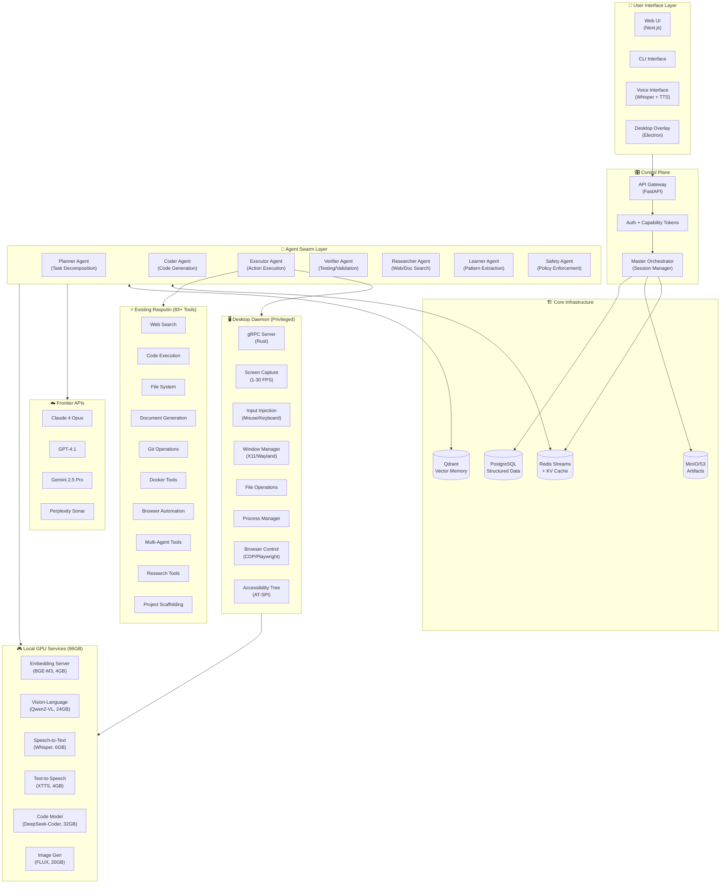
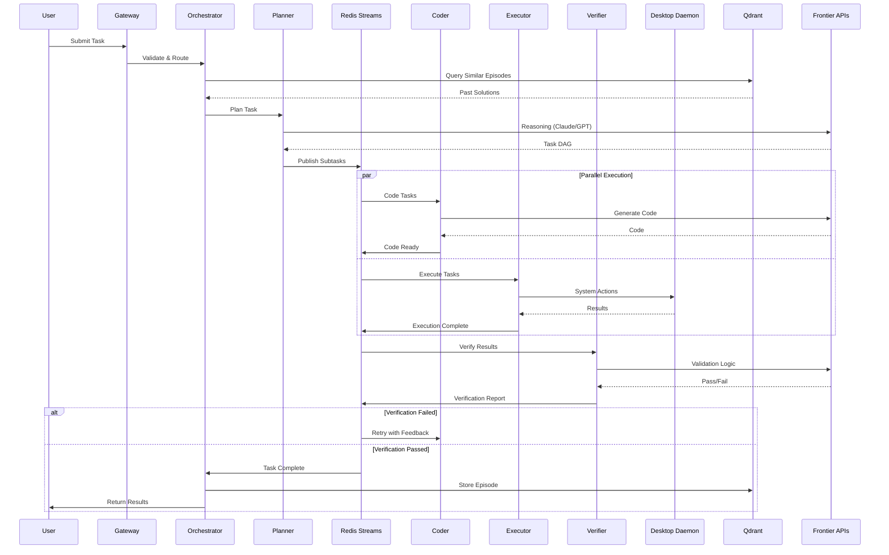

# JARVIS ULTIMATE v3 - The MANUS Killer

## Synthesized from GPT-5.2 Pro, Claude 4.5 Opus, Gemini 3.0 Pro, Grok 4

## Preserving and Extending 83+ Existing Rasputin Tools

---

# JARVIS v3: Ultimate Autonomous AI Operating System

## Complete Implementation Specification

---

# 1. Executive Summary

## 1.1 Mission Statement

JARVIS v3 transforms the existing Rasputin system from a capable AI assistant into the world's most powerful autonomous AI operating system. This specification details how to extend Rasputin's 83+ existing tools with:

1. **Desktop Daemon** - Full OS control rivaling MANUS (screen capture, input injection, window management, process control)
2. **Swarm Intelligence** - Multi-agent coordination with anti-thrash consensus protocols
3. **Episodic Memory** - Qdrant-powered learning that improves with every interaction
4. **Full-Stack Autonomy** - End-to-end web application development and deployment
5. **Hybrid Intelligence** - Frontier APIs for reasoning, local GPU for perception and speed

## 1.2 Key Differentiators vs. Competition

| Capability          | ChatGPT | MANUS | OpenCode | JARVIS v3                |
| ------------------- | ------- | ----- | -------- | ------------------------ |
| Frontier Reasoning  | ✅      | ❌    | ✅       | ✅ Multi-model consensus |
| Desktop Control     | ❌      | ✅    | ❌       | ✅ Privileged daemon     |
| Code Generation     | ✅      | ❌    | ✅       | ✅ With execution        |
| Multi-Agent Swarm   | ❌      | ❌    | ❌       | ✅ 7 specialized agents  |
| Episodic Memory     | ❌      | ❌    | ❌       | ✅ Qdrant learning       |
| Local GPU Inference | ❌      | ❌    | ❌       | ✅ 96GB VRAM             |
| Full Deployment     | ❌      | ❌    | Partial  | ✅ End-to-end            |

## 1.3 Hardware Target Specifications

```yaml
CPU: Intel Xeon (56 cores, 112 threads)
RAM: 256GB DDR5
GPU: NVIDIA RTX Pro 6000 Blackwell (96GB VRAM)
Storage: NVMe SSD (recommended 2TB+)
Network: 10Gbps+ for API calls
Users: 1-5 concurrent (not simultaneous heavy tasks)
```

## 1.4 Core Principles

1. **EXTEND, DON'T REPLACE** - Rasputin's 83+ tools remain the foundation
2. **SPEED FIRST** - Frontier APIs for reasoning, local GPU for perception
3. **FAIL GRACEFULLY** - Every component has fallbacks
4. **LEARN CONTINUOUSLY** - Every interaction improves the system
5. **SECURE BY DEFAULT** - Capability-based security, sandboxing, audit trails

---

# 2. Architecture Overview

## 2.1 System Architecture Diagram



## 2.2 Data Flow Diagram



## 2.3 Component Interaction Matrix

| Component    | Redis | Qdrant | Daemon | Frontier | Local GPU  | Rasputin     |
| ------------ | ----- | ------ | ------ | -------- | ---------- | ------------ |
| Orchestrator | R/W   | R      | -      | -        | -          | -            |
| Planner      | R/W   | R      | -      | R        | -          | -            |
| Coder        | R/W   | R/W    | -      | R        | R (CodeLM) | R (scaffold) |
| Executor     | R/W   | R      | R/W    | -        | R (Vision) | R/W (all)    |
| Verifier     | R/W   | R      | R      | R        | -          | R (tests)    |
| Researcher   | R/W   | R/W    | R      | R        | -          | R (search)   |
| Learner      | R     | R/W    | -      | R        | R (Embed)  | -            |
| Safety       | R/W   | R      | -      | R        | -          | -            |

---

# 3. Existing Rasputin Integration Map

## 3.1 Tool Category Mapping

The existing 83+ Rasputin tools map to JARVIS v3 agents as follows:

| Tool Category                     | Tools                                 | Primary Agent |
| --------------------------------- | ------------------------------------- | ------------- |
| Web Search (1)                    | web_search                            | Researcher    |
| Code Execution (3-5)              | execute_code, run_script, eval        | Executor      |
| File System (6-8)                 | read_file, write_file, list_dir       | Executor      |
| Document Gen (9-10, 67-68, 82-83) | generate_doc, create_report           | Coder         |
| SSH Remote (14-17)                | ssh_connect, ssh_exec, sftp           | Executor      |
| Git Operations (18-28, 51-52)     | git_clone, git_commit, git_push       | Coder         |
| Docker (29-30)                    | docker_run, docker_build              | Executor      |
| Dev Tools (32-40)                 | lint, format, test, build             | Coder         |
| Browser Auto (42-47)              | browser_open, click, type, screenshot | Executor      |
| Database (48)                     | sql_query                             | Coder         |
| Communication (49)                | send_message                          | Executor      |
| tmux Sessions (53-57)             | tmux_new, tmux_send, tmux_capture     | Executor      |
| Multi-Agent (58-59)               | spawn_agent, coordinate               | Planner       |
| Security (61-63)                  | check_permissions, audit              | Safety        |
| Vision (64-66)                    | analyze_image, ocr, describe          | Executor      |
| Audio (70-72)                     | transcribe, synthesize                | Executor      |
| Research (73-75)                  | deep_search, summarize                | Researcher    |
| Scaffolding (76-81)               | scaffold_project, generate_api        | Coder         |

## 3.2 Extension Points

### 3.2.1 New Tool Wrappers

Each existing tool gets wrapped with JARVIS v3 metadata:

```typescript
// jarvis/tools/wrapper.ts
interface JARVISToolMetadata {
  agentAffinity: (
    | "planner"
    | "coder"
    | "executor"
    | "verifier"
    | "researcher"
    | "learner"
    | "safety"
  )[];
  requiresLease: string[]; // Resources that need locking
  riskLevel: "low" | "medium" | "high" | "critical";
  estimatedDuration: number; // milliseconds
  canParallelize: boolean;
  qdrantCollections: string[]; // Collections to query/update
}

interface JARVISToolWrapper<T extends Tool> {
  tool: T;
  metadata: JARVISToolMetadata;
  beforeExecute(context: ExecutionContext): Promise<void>;
  afterExecute(result: ToolResult, context: ExecutionContext): Promise<void>;
  extractLearning(result: ToolResult): Promise<LearningPayload | null>;
}
```

---

# 4. Desktop Daemon Specification

## 4.1 Overview

The Desktop Daemon is the "MANUS-killer" - a privileged local service that provides complete OS control. It runs as a system service with elevated permissions and exposes a gRPC API for agents to control the desktop.

### 4.1.1 Design Principles

1. **Rust for Safety** - Memory-safe, zero-cost abstractions
2. **gRPC for Speed** - Low-latency, streaming support
3. **Capability-Based Security** - Fine-grained permission tokens
4. **Lease-Based Coordination** - Prevent multi-agent conflicts
5. **Full Audit Trail** - Every action logged

## 4.2 Core Capabilities

### Perception

- **Screen Capture**: Low-latency (60fps) DXGI/PipeWire capture
- **A11y Tree**: Direct access to UI automation trees
- **OCR**: Real-time text extraction via local GPU

### Action

- **Input Injection**: Hardware-level mouse/keyboard simulation
- **Window Mgmt**: Move, resize, focus, minimize/maximize
- **Process Ctrl**: Spawn, kill, monitor system processes

### System

- **File Ops**: High-speed I/O bypassing user shell
- **Network**: Packet capture and traffic analysis
- **Clipboard**: Read/write access to system clipboard

## 4.3 gRPC Service Definition

```protobuf
service DesktopDaemon {
  // Display & Screen
  rpc ListDisplays(ListDisplaysRequest) returns (ListDisplaysResponse);
  rpc Screenshot(ScreenshotRequest) returns (Screenshot);
  rpc ScreenStream(ScreenStreamRequest) returns (stream ScreenFrame);

  // Input
  rpc MouseMove(MouseMoveRequest) returns (Status);
  rpc MouseButton(MouseButtonRequest) returns (Status);
  rpc MouseScroll(MouseScrollRequest) returns (Status);
  rpc KeyboardKey(KeyboardKeyRequest) returns (Status);
  rpc KeyboardType(KeyboardTypeRequest) returns (Status);
  rpc KeyboardShortcut(KeyboardShortcutRequest) returns (Status);

  // Windows
  rpc ListWindows(ListWindowsRequest) returns (ListWindowsResponse);
  rpc FocusWindow(FocusWindowRequest) returns (Status);
  rpc MoveWindow(MoveWindowRequest) returns (Status);
  rpc WindowAction(WindowActionRequest) returns (Status);

  // Accessibility
  rpc GetAccessibilityTree(GetAccessibilityTreeRequest) returns (GetAccessibilityTreeResponse);
  rpc FindAccessibilityNode(FindAccessibilityNodeRequest) returns (FindAccessibilityNodeResponse);
  rpc PerformAccessibilityAction(PerformAccessibilityActionRequest) returns (Status);

  // File System
  rpc ListFiles(ListFilesRequest) returns (ListFilesResponse);
  rpc ReadFile(ReadFileRequest) returns (ReadFileResponse);
  rpc WriteFile(WriteFileRequest) returns (Status);
  rpc DeleteFile(DeleteFileRequest) returns (Status);
  rpc CopyFile(CopyFileRequest) returns (Status);
  rpc MoveFile(MoveFileRequest) returns (Status);

  // Processes
  rpc ListProcesses(ListProcessesRequest) returns (ListProcessesResponse);
  rpc StartProcess(StartProcessRequest) returns (StartProcessResponse);
  rpc KillProcess(KillProcessRequest) returns (Status);

  // Shell
  rpc ShellExec(ShellExecRequest) returns (ShellExecResponse);
  rpc ShellExecStream(ShellExecRequest) returns (stream ShellExecChunk);

  // Clipboard
  rpc GetClipboard(GetClipboardRequest) returns (GetClipboardResponse);
  rpc SetClipboard(SetClipboardRequest) returns (Status);

  // Browser
  rpc BrowserOpen(BrowserOpenRequest) returns (BrowserOpenResponse);
  rpc BrowserNavigate(BrowserNavigateRequest) returns (BrowserNavigateResponse);
  rpc BrowserClick(BrowserClickRequest) returns (Status);
  rpc BrowserType(BrowserTypeRequest) returns (Status);
  rpc BrowserEval(BrowserEvalRequest) returns (BrowserEvalResponse);
  rpc BrowserScreenshot(BrowserScreenshotRequest) returns (Screenshot);
  rpc BrowserGetContent(BrowserGetContentRequest) returns (BrowserGetContentResponse);
  rpc BrowserClose(BrowserCloseRequest) returns (Status);
}
```

## 4.4 Project Structure

```
jarvis-daemon/
├── Cargo.toml
├── build.rs                    # Proto compilation
├── proto/
│   └── daemon.proto
├── src/
│   ├── main.rs
│   ├── lib.rs
│   ├── config.rs
│   ├── auth/
│   │   ├── mod.rs
│   │   ├── capability.rs       # Capability token validation
│   │   └── middleware.rs       # gRPC auth interceptor
│   ├── lease/
│   │   ├── mod.rs
│   │   └── manager.rs          # Resource lease management
│   ├── audit/
│   │   ├── mod.rs
│   │   └── logger.rs           # Action audit logging
│   ├── controllers/
│   │   ├── mod.rs
│   │   ├── screen.rs           # Screen capture
│   │   ├── input.rs            # Mouse/keyboard injection
│   │   ├── window.rs           # Window management
│   │   ├── accessibility.rs    # AT-SPI integration
│   │   ├── file.rs             # File operations
│   │   ├── process.rs          # Process management
│   │   ├── shell.rs            # Shell execution
│   │   ├── clipboard.rs        # Clipboard access
│   │   └── browser.rs          # CDP browser control
│   ├── platform/
│   │   ├── mod.rs
│   │   ├── linux/
│   │   │   ├── mod.rs
│   │   │   ├── x11.rs
│   │   │   ├── wayland.rs
│   │   │   ├── uinput.rs
│   │   │   └── atspi.rs
│   │   └── windows/            # Future
│   │       └── mod.rs
│   └── service.rs              # gRPC service implementation
└── tests/
    └── integration_tests.rs
```

---

# 5. Implementation Phases

## Phase 1: Foundation (Weeks 1-4)

- [ ] Set up jarvis-daemon Rust project structure
- [ ] Implement gRPC proto definitions
- [ ] Basic screen capture (X11 only)
- [ ] Basic input injection (uinput)
- [ ] File operations controller
- [ ] Shell execution controller

## Phase 2: Desktop Control (Weeks 5-8)

- [ ] Window management (X11)
- [ ] Accessibility tree (AT-SPI)
- [ ] Clipboard controller
- [ ] Process management
- [ ] Wayland support
- [ ] Auth middleware with JWT

## Phase 3: Browser & Integration (Weeks 9-12)

- [ ] CDP browser controller
- [ ] Tool wrapper system for existing Rasputin tools
- [ ] Redis Streams integration
- [ ] Basic Qdrant episodic memory

## Phase 4: Swarm Intelligence (Weeks 13-16)

- [ ] Agent framework (7 specialized agents)
- [ ] Task DAG planner
- [ ] Anti-thrash consensus protocol
- [ ] Verifier agent with test execution

## Phase 5: Learning & Polish (Weeks 17-20)

- [ ] Learner agent with pattern extraction
- [ ] Self-improvement loops
- [ ] Performance optimization
- [ ] Security audit
- [ ] Documentation

---

# 6. Safety Considerations

## 6.1 Human-in-the-Loop

During alpha phase, the Desktop Daemon MUST have a killswitch:

- Physical keyboard shortcut (e.g., Ctrl+Alt+Shift+K) to immediately halt all daemon operations
- All "critical" risk level operations require explicit user confirmation
- Rate limiting on input injection (max 100 actions/second)

## 6.2 Sandboxing

- File operations restricted to allowed_paths by default
- Process execution sandboxed via seccomp/AppArmor
- Network operations logged and rate-limited

## 6.3 Audit Trail

Every daemon action is logged with:

- Timestamp
- Session ID
- User ID
- Action type
- Parameters
- Result
- Duration
